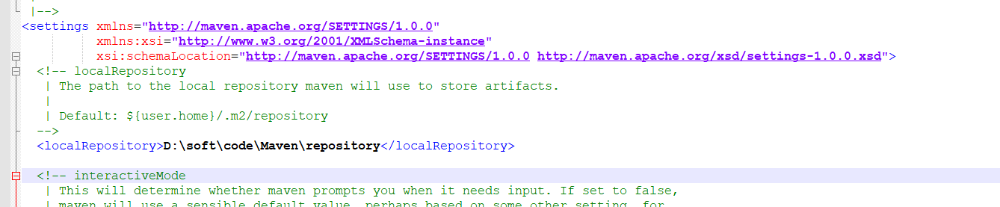
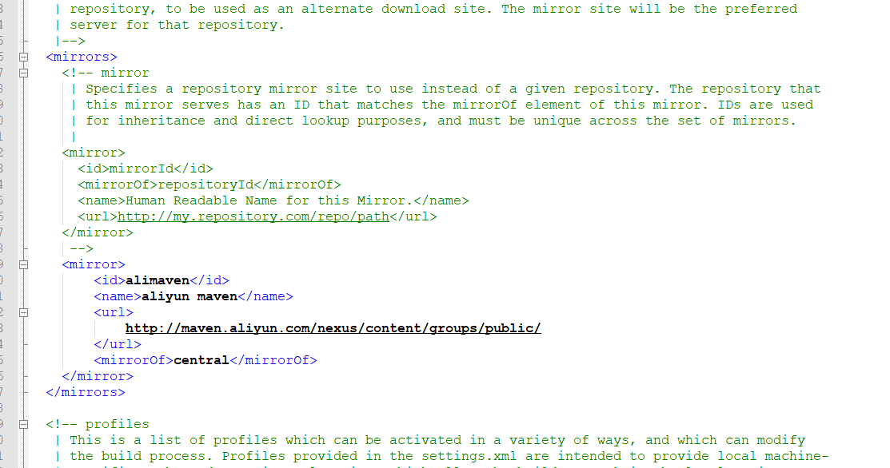
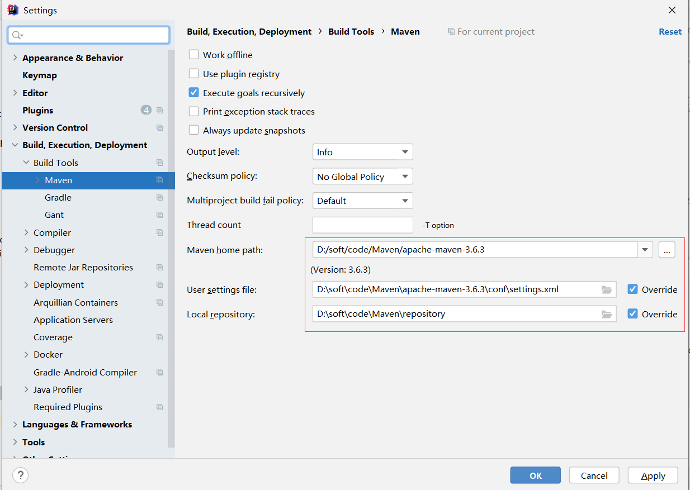
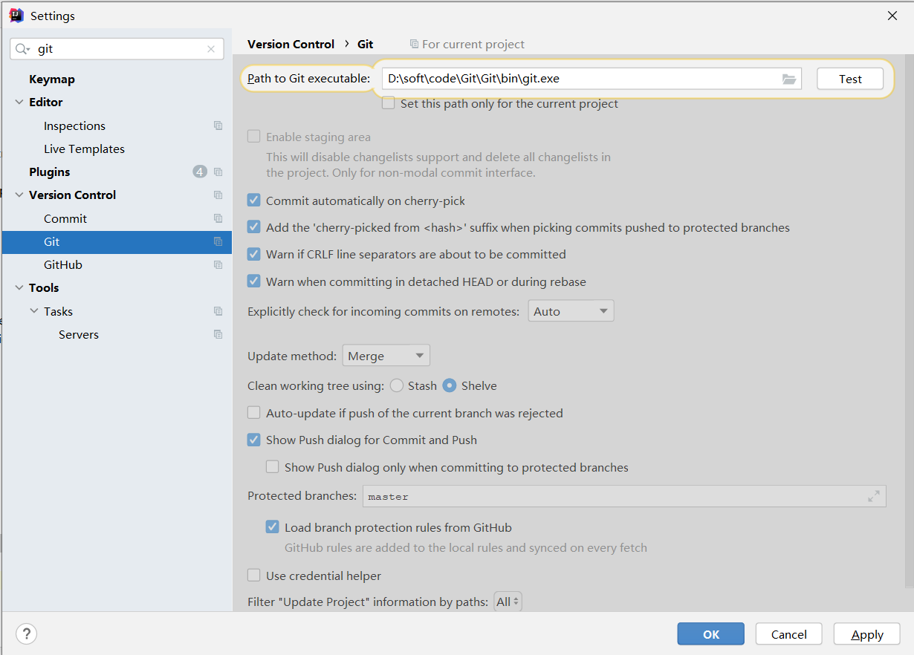
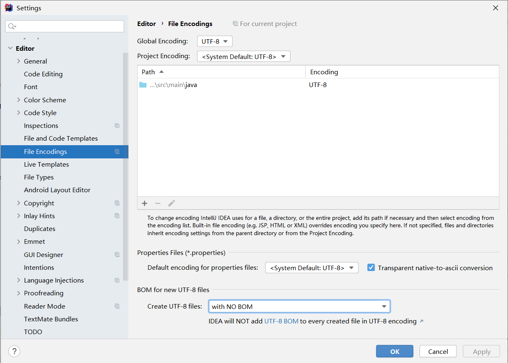
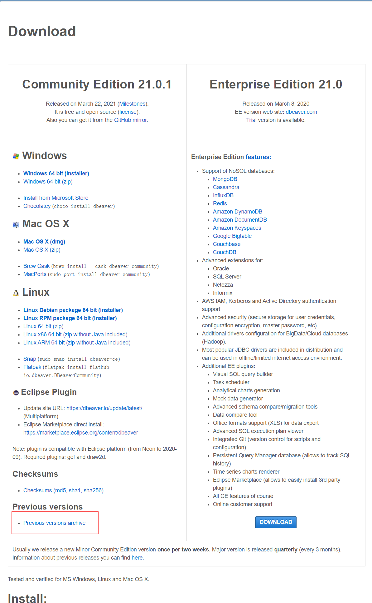

# jdk环境配置

文件在群里

右键此电脑---->属性---->高级系统设置----->环境变量

新建（系统变量）

```
JAVA_HOME:jdk解压目录（到bin的上一层）
```


选择path，点击编辑---->新建

```
%JAVA_HOME%\bin
```


win+r，输入cmd，打开命令行

输入

```
java -version
```

出现版本号安装成功

输入

```
javac
```

出现一长串，说明环境配置好了

# mysq安装

官网：https://dev.mysql.com/downloads/mysql/5.7.html#downloads


https://blog.csdn.net/dhj199181/article/details/115276076

# maven安装配置

文件在群里
https://www.runoob.com/maven/maven-setup.html

修改settings文件
1、修改仓库位置（自己在D盘新建一个文件夹，写自己的路径）


2、修改镜像加速


```
    <mirror>
        <id>alimaven</id>
        <name>aliyun maven</name>
        <url>
            http://maven.aliyun.com/nexus/content/groups/public/
        </url>
        <mirrorOf>central</mirrorOf>
    </mirror>
```
# IDEA
官网：https://www.jetbrains.com/zh-cn/idea/download/#section=windows
激活码：http://idea.medeming.com/jets/

1、修改maven相关配置


2、git配置


3、编码


DBeaver
安装：https://dbeaver.io/download/
